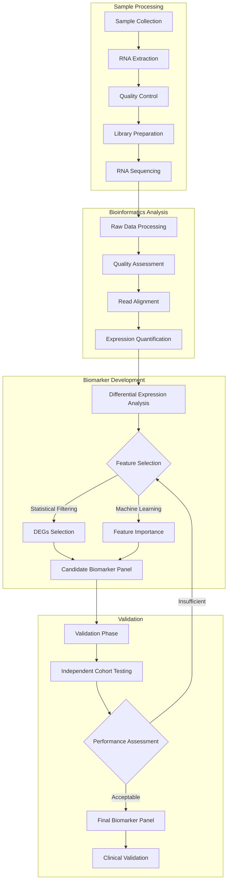

# Welcome to My NIH Work!

Hi! I'm omw to start my first work  in **NIH** under **Dr Chris Grunseich** . If you want to learn about his work [click here](https://research.ninds.nih.gov/staff-directory/christopher-grunseich-md) !

[](https://www.gnu.org/licenses/gpl-3.0)

# Overview

This repository contains the complete pipeline for developing RNA-seq based biomarkers for Amyotrophic Lateral Sclerosis (ALS). The pipeline integrates sample processing, RNA sequencing, bioinformatics analysis, and machine learning approaches to identify and validate potential biomarkers for ALS diagnosis and progression monitoring.

[](https://www.python.org/downloads/)



### Python Packages
```bash
pip install -r requirements.txt
```
### Core Requirements
- Python ≥3.8
## Contributing

1. Fork the repository
2. Create your feature branch (`git checkout -b `)
3. Commit your changes (`git commit -m `)
4. Push to the branch (`git push origin `)
5. Open a Pull Request

## Citation

If you use this pipeline in your research, please cite:
```bibtex
@{als_biomarker_pipeline,
  author = {Arnav Sonavane, Harshal Mahale, Dr. Chris Grunseich},
  title = {ALS RNA-seq Biomarker Development Pipeline},
  year = {2024},
  publisher = {GitHub},
  url = {https://github.com/w2sg-arnav/NiH_work}
}
```

## Contact

- **Project Lead:** [Arnav Sonavane](mailto:sonavane.arnav2@gmail.com)

## Acknowledgments

- Institution/Lab name : National Institute of Health (NINDS)
- Funding sources:  Contact Dr. Grunseich.
- Collaborators : Dr. Chris Grunseich, Harshal Mahale

## License

This project is licensed under the GNU General Public License v3.0 - see the [LICENSE](LICENSE) file for details.

### What this means:
- You can freely use, modify, and distribute this software
- Any modifications or software that includes this code must also be released under GPL-3.0
- You must include the original copyright and license notice in any copy of the software/source
- You must state significant changes made to the software
- You must disclose your source code when you distribute the software

For more details, please refer to the [full GPL-3.0 license text](https://www.gnu.org/licenses/gpl-3.0.en.html).
